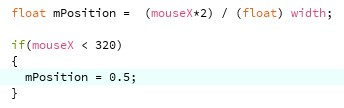
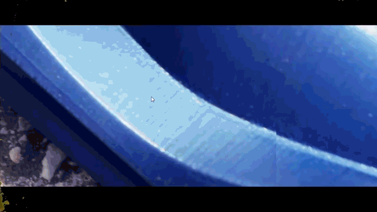
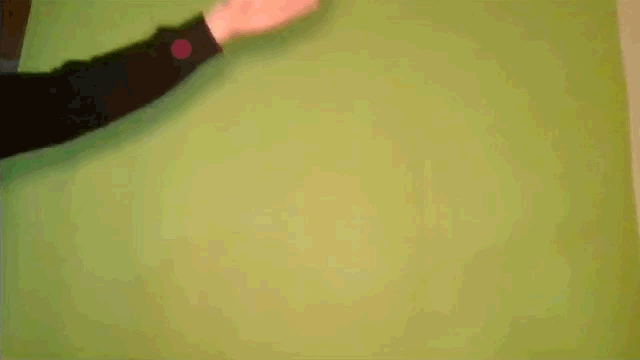
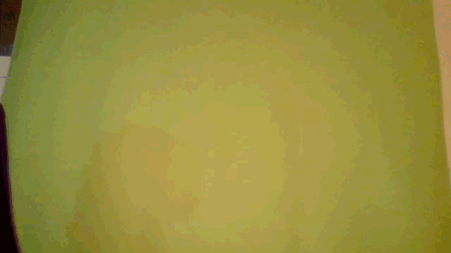
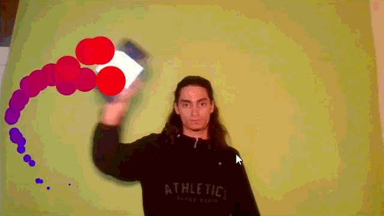
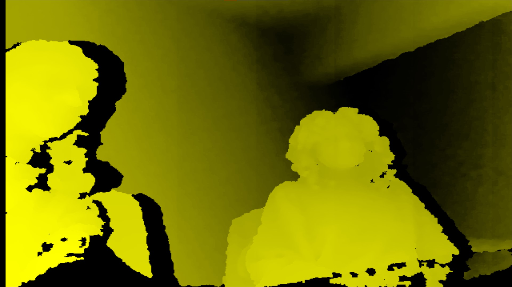
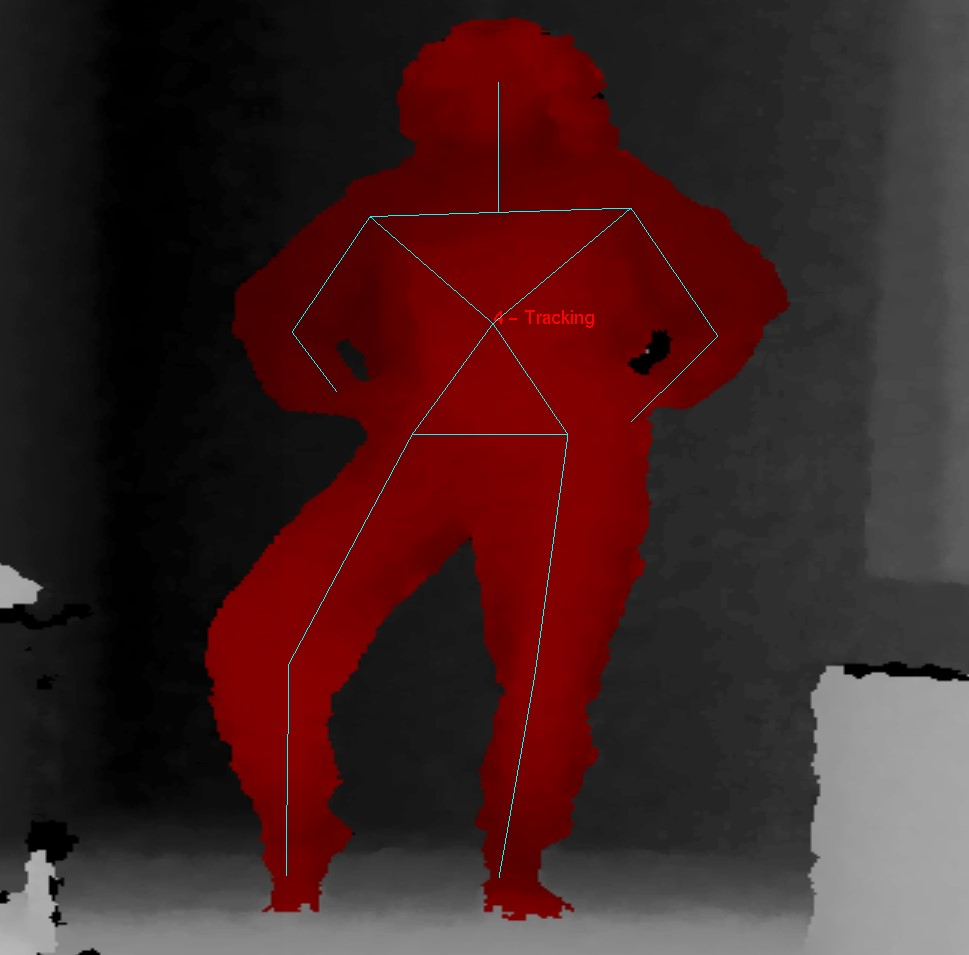
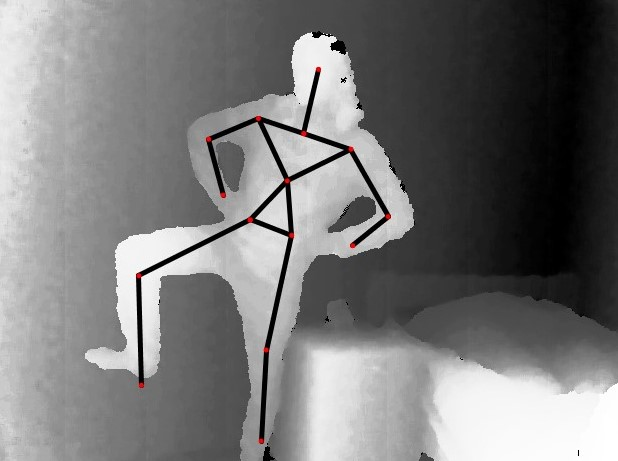
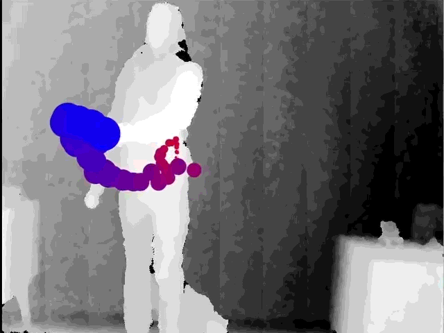
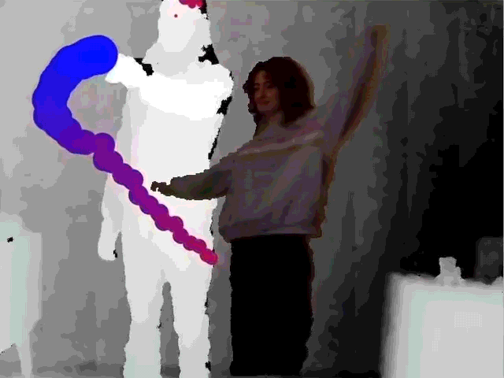

# Lesson: Advanced Interaction Technologies & Applications

### First and Last Name: Efstratios Koutoulakis
### University Registration Number: dpsd19061
### GitHub Personal Profile: [dpsd19061](https://github.com/dpsd19061)
### Advanced Interaction Tecnologies & Applications Github Personal Repository: [Repository](https://github.com/dpsd19061/Advanced-Interaction-Tecnologies-Applications-Individual-Assignment)

# Introduction

# Summary

# 1st Deliverable

### 1ο Μέρος Παραδοτέου

--> Tο πρώτο task ήταν αρκετά απλό, άνοιξα το 1ο παράδειγμα του 16ου κεφαλαίου. Βεβαια η άσκηση δεν είχε τελειώσει διότι καθώς έτρεχα τον κώδικα "έσκαγε" ένα error. Δεν αναγνώριζε την κάμερα μου παρόλο που ήταν built in στο laptop μου. Εψαξα το σφάλμα και από [εδω](https://discourse.processing.org/t/processing-cant-find-the-camera-video-libraries-dont-work/25128) βρήκα πώς να το λύσω.

### 2ο Μέρος Παραδοτέου

--> Στο δεύτερο task χρησιμοποίησα αρκετό κώδικα από το βιβλίο (παραδείγματα 16-4 & 16-5) και υλοποίησα το περισσότερο κομμάτι. Για την ταχύτητα αναπαραγωγής, χρησιμοποιώντας την εντολή speed διαιρόντας το πλάτος του παραθύρου με το διπλάσιο position του mouse καταφέρνω να κάνω την ταχύτητα να αυξάνεται στο δεξύ μέρος της οθόνης και αντίστοιχα μειώνεται στο αριστερό μέρος. Μια προσθήκη που έκανα, επειδή οταν το ποντίκι πηγαίνει πολύ αριστερά στην οθόνη, η ταχύτητα του βίντεο γίνεται υπερβολικά αργή, πρόσθεσα ενα if statement που λειτουργεί ως εξής: Οταν το ποντίκι βρίσκεται μεσα στα πρωτα 320 pixels η ταχύτητα παραμένει σταθερή στο 0.5. Ετσι η ταχύτητα μεταβάλλεται σε λογικά πλαίσια.

### 3ο Μέρος Παραδοτέου

--> Το τρίτο task ήταν επίσης αρκετά εύκολο. Κατεβάζοντας την βιβλιοθήκη και από το site που μας δόθηκε και χρησιμοποιώντας τον κώδικα που παρείχε κατάφερα να κάνω decode την φωτογραφία με το QR. Από [εδώ](https://processing.org/examples/embeddedlinks.html) βρήκα τον τρόπο με τον οποίο ανοίγω το link που αποθηκεύεται στο εκάστοτε string. Για να εμφανίσω την φωτογραφία του QR, πολύ απλά έριξα μια μικρή ματιά στο κεφάλαιο 15 του βιβλίου.

### 4ο Μέρος Παραδοτέου

--> Στο τέταρτο task το μόνο που χρειάστηκε να κάνω ήταν να βάλω την εντολή που ανοίγει το URL μέσα στη μέθοδο που κάνει decode το QR και να φτιάξω έναν data φάκελο και να βάλω την φωτογραφία του QR. Οπότε όταν έχω το QR στην κάμερα και πατήσω το space το πρόγραμμα βγάζει ένα προσωρινό screenshot, το κάνει decode και ανοίγει το URL σε μια καρτέλα. Όταν όμως πατήσω το πλήκτρο f θα γίνει η ίδια διαδικασία απλά η φωτογραφία θα παρθεί από τον data φάκελο.

### 5ο Μέρος Παραδοτέου

--> Τέλος, ανοίγοντας το παράδειγμα από την βιβλιοθήκη για το AR και χρησιμοποιώντας κώδικα από το 2ο μέρος του παραδοτέου πρόσθεσα τον κώδικα που απαιτείται για φόρτωμα και αναπαραγωγή βίντεο και αντικατέστησα τις γραμμές κώδικα που σχημάτιζαν το box με τον κώδικα που εμφανίζει βίντεο. Βέβαια για να αποθηκεύσω το παράδειγμα ως ένα νέο sketch χρειάστηκε να μεταφέρω δύο αρχεία στο data φάκελο από τους φακέλους της βιβλιοθήκης και να αλλάξω κάποια paths μέσα στο processing.

# 2nd Deliverable

### 1ο Μέρος Παραδοτέου

--> Για το πρώτο task η διαδικασία υλοποίησής του έχει ως εξής: Σε πρώτη φάση, πρόσθεσα οτιδήποτε γραμμές κώδικα του παραδείγματος 16-11 που βοηθούν στο να φορτώσουν και να παίξουν το βίντεο στο background. Σε δεύτερη φάση, όπως αποθηκεύεται το χρώμα για κάθε pixel του βίντεο της κάμερας έτσι πρόσθεσα την ίδια εντολή γα να αποθηκεύεται το χρώμα για κάθε pixel του έτοιμου βίνεο. Τελος, το πρόγραμμα συγκρίνει τα pixels του background με τα ανανεωμένα pixels της κάμερας και ξέρει ακριβώς ποια pixel να αντικαταστήσει με το βίντεο και ποια να τα αφήσει (τα διαφορετικά pixels της κάμερας) ως έχου ανάλαγα με το threshold.

### 2ο Μέρος Παραδοτέου

--> Στο δεύτερο task άλλαξα το παράδειγμα 16_13 ως εξής: Πρόσθσα βίντεο από την κάμερα, ετσι ώστε να μην φαίνεται το ασπρόμαυρο και έγραψα τέτοιο κώδικα έτσι ώστε να υπολογίζει τον μέσο όρο των κάθε pixels που έχουν ανανεωθεί πρόσφατα (δηλαδή τοποθετεί τη σφαιρα στο μέσο όρο του εμβαδού των pixels).

### 3ο Μέρος Παραδοτέου

--> Το τρίτο task ήταν αρκετά απλό. Αντικατέστησα τις γραμμές κώδικα που ανοίγουν την κάμερα με τις γραμμές κώδικα που φορτώνουν καταγεγραμμένο βίντεο. Αλλαξα επίσης το χρώμα απο κόκινο σε μώβ και έβαλα ένα ημιδιαφανές fill.

--> **Απάντηση Ερώτησης:** Τα πλεονεκτήματα της έτοιμης βιβλιοθήκης είναι οτι μπορύμε να χρησιμοποιούμε έτοιμο κώδικα, χωρίς να γράφουμε δικό μας απο την αρχή, πράγμα που γλιτώνει υπερβολικά πολύ χρόνο. Με λίγα λόγια, δεν χρειάζεται να "εφευρίσκουμε τον τροχό από την αρχή". Επιπλέον ένα ακόμα πλεονέκτημα είναι οτι μια βιβλιοθήκη μπορεί να λειτουργεί και να ανταποδίδει καλύτερα αποτελέσματα απο έναν απλό developer γιατί η βιβλιοθήκη έχει κατασκευαστεί από ομάδα επαγγελματιών. Τα μειονεκτήματα της έτοιμης βιβλοθήκης είναι οτι αν έχουμε σκοπό να φτιάξουμε ένα πρόγραμμα με πολύ συγκεκριμένα ζητούμενα, η βιβλιοθήκη ενδεχομένως να μήν μας παρέχει πάντα αυτό που θέλουμε και δεν είναι εύκολο να τροποποιήσουμε τη βιβλιοθήκη με αποτέλεσμα να γράφουμε από την αρχή δικό μας κώδικα έστι ακριβώς όπως τον θέλουμε

### 4ο Μέρος Παραδοτέου

--> Τέλος το τέταρτο task ήταν επίσης εύκολο. Αντικατέστησα το κομμάτι κώδικα που φτιάχνει τη σφαίρα με τον κωδικα που δημιουργεί το φίδι. Σημαντική λεπτομέρεια είναι οτι στον κώδικα του φιδιού, αντί για να ακολουθεί το x και y του ποντικού, τον άλλαξα έτσι ώστε να ακολουθεί το χρώμα που έχει επιλεχθεί. Επιπλέον έπαιξα και με τα χρώματα του φιδιού για αισθητικούς σκοπούς.

--> **Απάντηση Ερώτησης:** Τα πλεονεκτήματα χειρισμου του φιδιού με color tracking είναι οτι είναι πιο άμεσο και πιο διαδραστικό για τον χρήστη, επικοινωνεί άμεσα με το πρόγραμμα κινώντας αντικείμενα ή μόνο με το σώμα του. Τα μειονεκτήματα αυτού είναι οτι λόγω φωτισμού και ποιότητας κάμερας τα χρώματα αλλάζουν συνεχώς και αποτεσματικά το φίδι ενδέχεται να "τρεμοπαίζει" ή να μερδέυεται με παρόμοια χρώματα στην οθόνη και να μετακινείται σε ανεπιθύμιτες τοποθεσίες.

# 3rd Deliverable 

# Bonus 

## Σε συνεργασία με: [Evedes01](https://github.com/Evedes01)

### 0. Kinect Installation

--> Coming Soon

### 1. Nearest Point Tracking

--> Coming Soon

### 2. Background Removal

--> Coming Soon

### 3. Right-Hand Tracking

--> Coming Soon

# Bonus 2

## Σε συνεργασία με: [Evedes01](https://github.com/Evedes01)

# Conclusions

# Sources
